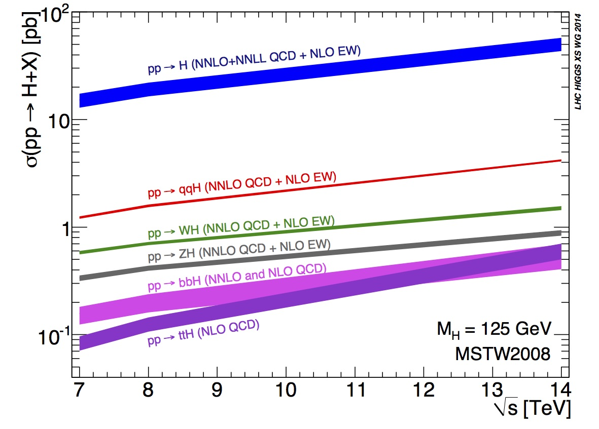
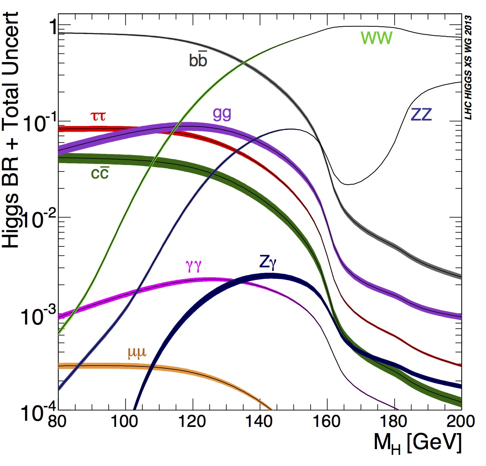
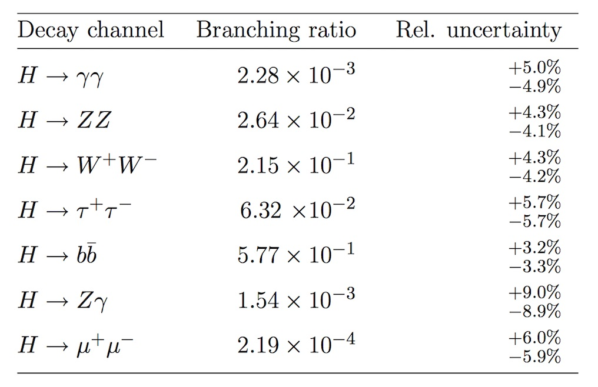

# The Higgs Boson

The [Standard Model](http://atlas.cern/discover/physics) of particle physics is a theory that describes the known matter in terms of its elementary constituents and their interactions. It is a widely proven and very successful theory in modern physics.  

The [Higgs boson](https://home.cern/topics/higgs-boson) is a fundamental particle, first observed by ATLAS and CMS in 2012, although theorised in the 1960s. The Higgs boson is the carrier particle for the Higgs field, a field present throughout our universe, which gives particles their mass. The more a particle interacts with the Higgs field, the higher its mass.

## Higgs boson production

Standard Model production of the Higgs boson at the LHC is dominated by the

* gluon fusion process: $$gg \rightarrow H$$

followed by the

* vector-boson fusion process: $$qq' \rightarrow qq'H$$

Associated production also have sizeable contributions, with

* a $$W$$ boson :
* a $$Z$$ boson :
* or a pair of top quarks: $$q\bar q/gg \rightarrow t\bar t H$$

Smaller contributions are expected from production in association with

* $$b$$-quarks : $$b\bar bH$$
* a single top quark : $$tH$$

The figure above shows the Standard Model Higgs boson production cross sections as a function of the center of mass energy, $$\sqrt{s}$$, for pp collisions. Effectively, how likely each type of Higgs production is, for different LHC energies.  The theoretical uncertainties are indicated as a band [PDG](http://pdg.lbl.gov/2013/reviews/rpp2013-rev-higgs-boson.pdf).

Quantum chromodynamics \(QCD\) and Electroweak \(EW\) models are used to predict the production cross sections. Next-to-leading order\(NLO\) and next-to-next-to leading order \(NNLO\) calculations are carried. High order corrections are required to achieve the desired precision for these predictions.

## Higgs decay

According to the Standard Model, the Higgs boson can decay into pairs of fermions or bosons.

The Higgs boson mass is not predicted by the Standard Model, but once measured the production cross sections and branching ratios can be precisely calculated.

The Standard Model Higgs boson decay branching ratios and total width are shown in the figure above \[[PDG](http://pdg.lbl.gov/2013/reviews/rpp2013-rev-higgs-boson.pdf)\]. You can see that the decay modes change in prominance depending on the mass of the Higgs, M$$_{H}$$.  

Effectively, this diagram expresses how likely the Higgs is to decay into a certain particle, or group of particles, depending on the mass of the Higgs.

The Higgs mass has now been measured to be   
125 GeV \([see combined measurement by ATLAS and CMS](http://journals.aps.org/prl/abstract/10.1103/PhysRevLett.114.191803)\).  
We can see from the figure above that the prominent decay modes at M$$_{H}$$= 125 GeV are

* $$ H \rightarrow b\bar b$$
* $$ H \rightarrow WW$$

followed by

* $$ H \rightarrow gg$$
* $$ H \rightarrow \tau^{+}\tau{-}$$
* $$ H \rightarrow c\bar c$$
* $$ H \rightarrow ZZ $$

The following table displays the branching ratios and the relative uncertainty for a Standard Model Higgs boson with mass M$$_{H}$$ = 125 GeV [PDG](http://pdg.lbl.gov/2013/reviews/rpp2013-rev-higgs-boson.pdf).

The decay mode with the highest branching ratio \(BR\) is the decay to [hadrons](https://en.wikipedia.org/wiki/Hadron), BR $$\sim$$ 70%, which is not easy to detect due to [QCD](https://en.wikipedia.org/wiki/Quantum_chromodynamics) background.

A large fraction of the [leptonic](https://en.wikipedia.org/wiki/Lepton) decays are to a pair of [neutrinos](https://en.wikipedia.org/wiki/Neutrino), BR $$\sim$$ 20%, which are difficult to detect since they hardly interact with matter.

The decay to pairs of electrons, muons and taus have a BR of about 10% of the total.

In fact, the tau [life time](https://en.wikipedia.org/wiki/Particle_decay) is very short, 3x10$$^{-13}$$s, so it can be reconstructed only from its decay products. The efficiency of reconstructing taus is much lower than that of electrons and muons. So essentially, focusing on decays into electrons and muons, we are chasing just 6% of all the possible Higgs produced in the [LHC](https://en.wikipedia.org/wiki/Large_Hadron_Collider).
