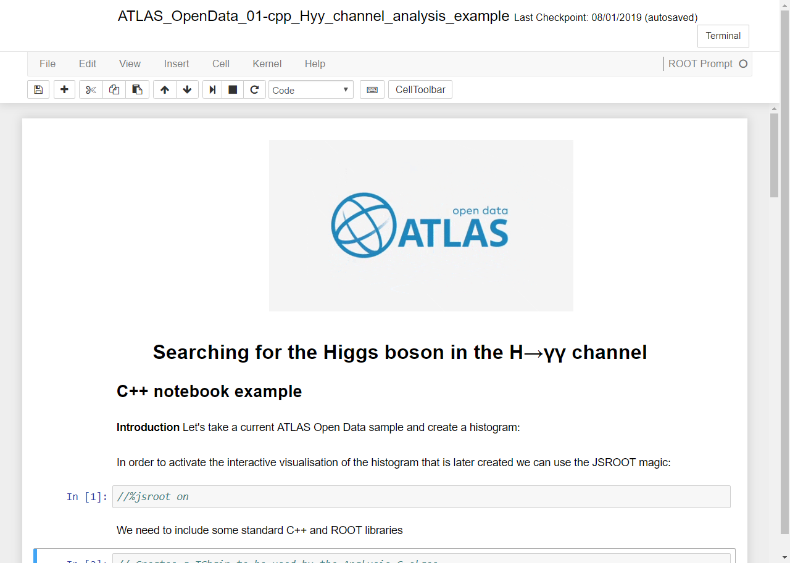
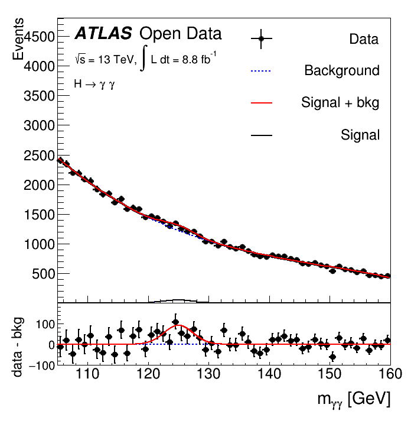
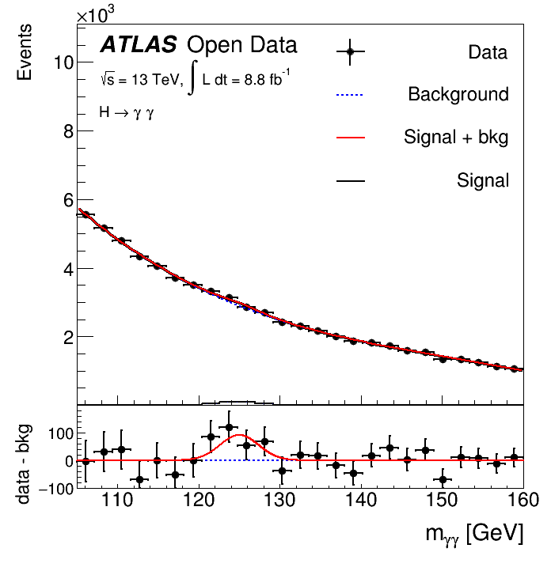

This part will detail on the two kinds of motebooks: analysis examples and framework interfaces.
To facilitate university students in their early years, new PhD students and post-doctoral researchers, as well as senior researchers and teachers who want to refresh their data analysis skills or to introduce a more friendly and yet very powerful open source tool in the classroom, we developed these notebooks as analysis examples as well as a portal to the much heavier frameworks presenting the potential of enhancement and expansion of educational and training programs.
Such tools have been already tested in several environments: ATLAS Open Data Virtual Machine, MyBinder and SWAN. A fully web-based integration of the tools and the Open Access Data repositories bring the possibility to go a step forward in the ATLAS quest of making use of several CERN projects in the field of the education and training, developing new computing solutions on the way.

## **Analysis Example: Searching for the Higgs boson in the H-$\gamma \gamma$ decay channel**

These analysis examples are written in both C++ and Python with Jupyter notebook with ROOT kernel and PyROOT extension. See the user interfaces in the figure above.
The aim is to show students how this H-$\gamma\gamma$ channel was used in the Higgs discovery. This analysis implements a simplified criteria for single Higgs boson events with the Higgs boson decaying to photons using the 13 TeV dataset, that enable users to develop an understanding of a Higgs analysis. To reproduce selection requirements to reconstruct a simple invariant-mass peak, the following simplified photon selection criteria would be needed:

 - Diphoton trigger is satisfied;
 - Event in real data passes the Good Run List;
 - Event has a good vertex ($Ntracks > 2$);
 - Exactly two good photons with $pT > 25 GeV$;
 - $ET/m_{\gamma\gamma} > 0.35$ for leading photon;
 - $ET/m_{\gamma\gamma} > 0.25$ for subleading photon;
 - 105 GeV < m < 160 GeV.

(a)

(b)

Diphoton invariant mass spectrum observed in 13 TeV data in selected events, with different binning in the X-axis between (a) and (b). The solid red curve shows the fitted signal-plus-background model when the Higgs boson mass is constrained to be 125 GeV. The background component of the fit is shown with the dotted blue curve. The signal component of the fit is shown with the solid black curve. The bottom plot shows the residuals between the data and the background component of the fitted model.

 The shape of the invariant mass of the signal is modelled by a Gaussian function. The background is estimated from data by fitting the diphoton mass spectrum in the mass range 100 - 160 GeV with a fourth-order polynomial function with free parameters of shape and normalization. The observed invariant mass distribution of the selected diphoton pairs is shown in figure above. The result of a fit including a signal component fixed to $m_H$ = 125 GeV and a background component described by a fourth-order polynomial is superimposed. A mild excess near $m_{\gamma_\gamma}$ = 125 GeV is visible in data.
